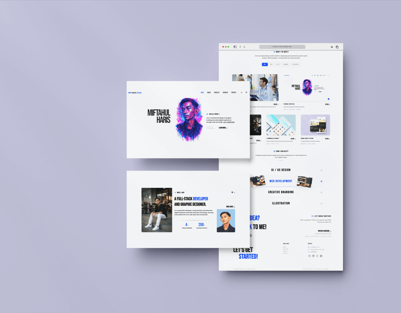
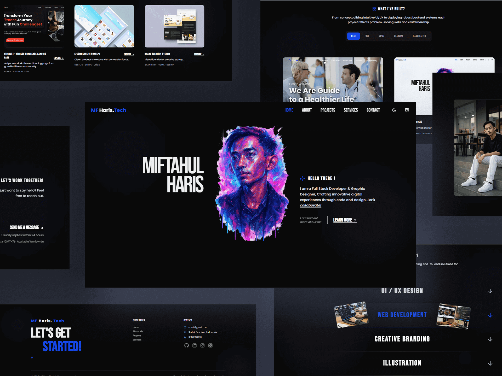

# ⚡ Personal Portfolio

A modern and interactive **developer portfolio website** built to showcase projects, skills, and services with a strong focus on **clean design, smooth animations, and user experience**.

---

# 🌐 Live Website

🔗 https://personal-portfolio-theta-nine-60.vercel.app/

---

# 🖥 Portfolio Preview

### Light Mode

### Dark mode

---

# ✨ Features

• Smooth page transitions and UI animations
• Responsive design for desktop, tablet, and mobile
• Dark / Light theme support
• Interactive project showcase
• Dedicated project detail pages
• Animated UI using Framer Motion
• Contact modal for easy communication
• Clean component-based architecture

---

# 🧠 Design Philosophy

This portfolio is built around three core principles:

### Clarity

Designing solutions that are simple, focused, and easy to understand.

### Consistency

Maintaining a coherent visual language across all sections.

### Experience

Enhancing the interface with smooth animations and interactive transitions.

---

# ⚙️ Tech Stack

### Frontend

* React
* Vite
* Tailwind CSS

### Animation

* Framer Motion

### Routing

* React Router

### Icons

* Lucide Icons

### Deployment

* Vercel

---

# 📂 Project Structure

src/

components/ → reusable UI components
pages/ → main pages
data/ → project data and configuration
providers/ → context providers
assets/ → images and static assets

---

# 🚀 Getting Started

Clone the repository

git clone https://github.com/MF-Harisz/personal-portfolio.git

Go to the project directory

cd personal-portfolio

Install dependencies

npm install

Run the development server

npm run dev

---

# 📱 Responsive Design

The portfolio is optimized for:

Desktop
Tablet
Mobile

---

# 📌 Future Improvements

• Blog / article section
• Project filtering system
• Performance analytics integration
• Additional micro-interactions

---

# 👨‍💻 Author

MF Haris

GitHub
https://github.com/MF-Harisz

---

# ⭐ Support

If you like this project, consider giving it a **star** on GitHub.
